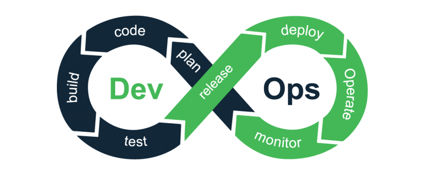
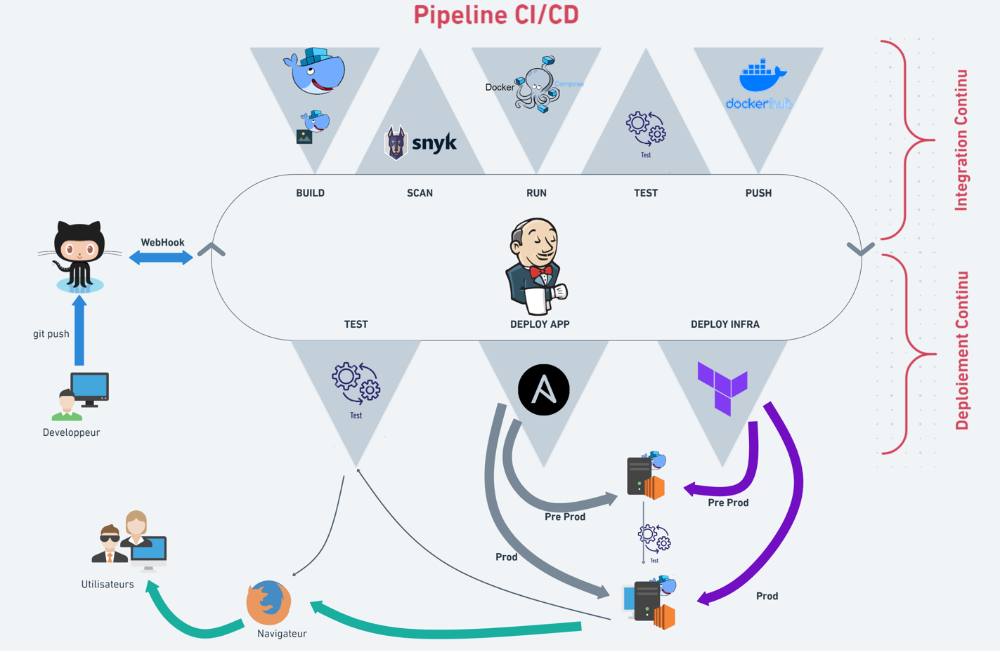
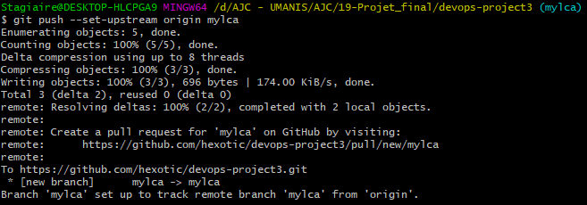

# Sommaire

* Introduction
  * Qu'est-ce que le DevOps ?
  * Contexte du projet et organisation

* Présentation du projet
  * Description des travaux demandés
    * Objectif
    * Outils recommandés
    * Build
    * Sécurité
  * Présentation de Django
  * Outils recommandés
    * Docker
    * Jenkins
    * Terraform
    * Ansible
    * Snyk

* Travaux réalisés
  * Organisation
  * Création d'une machine virtuelle (EC2) AWS
  * Détails du pipeline
    * Intégration continue (CI)
      * GitHub
      * Conteneurisation
      * Jenkins
    * Déploiement continu (CD)
      * Environnements
        * Environnement de préproduction
        * Environnement de production
        * Infrastructure as Code (IaC)
      * Terraform
      * Ansible
  * Résultats obtenus

* Problèmes rencontrés et axes d'amélioration
  * Problèmes rencontrés
  * Axes d'amélioration

* Conclusion

<div style="page-break-after: always;"></div>

# Introduction
<div style="text-align: justify">

Dans le monde de l'IT ("Information Technology"), il existe deux grands corps de métiers : les développeurs logiciels (Dev) et les administrateurs de systèmes et d'architectures (Ops). Les objectifs de ces deux fonctions peuvent paraitrent antagonistes. En effet, les Dev ont pour mission de créer, d'optimiser et de faire évoluer rapidement des applications en fonction des dernières technologies. Les Ops, quant à eux, peuvent être réticents aux changements car ils doivent assurer la mise en production de l'application en garantissant sa disponibilité et son temps de réponse. Historiquement, ces deux équipes, tout en travaillant sur un projet commun, effectuaient leurs tâches séparemment et communiquaient très peu (culture de silo). L'isolement de ces deux équipes pouvaient donc entrainer des conflits qui ont menés à la création d'un "mur de la confusion" séparant l'équipe Dev souhaitant de rapide mise à jour de l'application et l'équipe Ops jugeant par la stabilité de cette application.
De plus, l'arrivée des méthodes Agile (comme Scrum), préconisant plutôt la fixation d’objectifs à court terme par la réalisation de courts cycles de développement (itérations), ont considérablement raccourci les délais dans la mise à jour des applications pour la correction d'erreur ou l'ajout de nouvelles fonctionnalités. De plus, l'essor important de ces méthodes Agiles peut s'expliquer par l'amélioration, entre autres, du délai entre le développement d’une application et sa disponibilité pour les utilisateurs (time-to-market). Pour ces raisons, les entreprises du secteur informatique ont dû changer de mode de fonctionnement et la culture DevOps a pu apparaitre.
</div>

## Qu'est-ce que le DevOps ?

<div style="text-align: justify">

Pour commencer, le terme DevOps a été créé en 2007 par Patrick Debois pour créer une culture visant à rassembler les équipes Dev et Ops. Cette combinaison de <bold>philosophies</bold> de travail a pour principal objectif de permettre la livraison d'applications (ou de fonctionnalités / services) dans des délais optimisés tout en améliorant la qualité et la fiabilité de ces applications. Pour cela, le DevOps doit permettre l'amélioration de la collaboration entre les équipes Dev et Ops tout en utilisant différentes technologies pour automatiser l'intégralité du processus de conception d'une application.

Ainsi, le DevOps va particulièrement contribuer à l'automatisation et à l'amélioration du CI/CD qui constituent les deux grandes phases du cycle de conception d'une application :

* CI ("Continuous Integration") : correction, amélioration et tests du code de l'application en continu
* CD ("Continuous Deployment") : déploiement et mise en exploitation continu des nouvelles versions de l'application

En effet, la culture DevOps intervient lors de toutes les phases du cycle de conception d'une application assurés pes les équipes Dev et Ops :

* "Continuous Integration" par l'équipe Dev :
  * "Plan" : identification du besoin et des exigences
  * "Code" : écriture du code et conception de l'application
  * "Build" : création du "package" du code de l'application
  * "Test" : réalisation de tests sur l'application
* "Continuous Deployment" par l'équipe Ops :
  * "Release" : adaptation de l'application pour son déploiement
  * "Deploy" : déploiement de l'application sur différents serveurs (environnements)
  * "Operate" : mise en exploitation de l'application
  * "Monitor" : supervision de l'application et de sa disponibilité

</div>

<div style="text-align: center">Cycle de conception d'une application</div>

<div style="text-align: justify">
En plus des différentes technologies utilisées pour assurer toutes ces étapes du cycle de conception d'une application, le DevOps se repose sur cinq piliers illustrés par le sigle C.A.L.M.S. :

* **C**ulture : partage d'une culture commune par toutes les personnes de l'entreprise
* **A**utomatisation : automatisation des processus pour faciliter les tâches des équipes Dev et Ops
* **L**ean : application de la méthodologie LEAN pour améliorer l'organisation et l'efficacité des équipes
* **M**esure : évaluation de l'avancement des tâches et de différents indicateurs pour augmenter l'efficacité
* **S**olidarité : amélioration du travail en équipe

</div>

## Contexte du projet et organisation

<div style="text-align: justify">

Le projet décrit dans ce rapport est un projet de fin de formation réalisée avec l'institut de formation AJC. Dans le cadre d'une POEI avec la société Umanis, cette formation "Consultant DevOps" de trois mois a pour objectif principal de comprendre les enjeux de la méthodologie DevOps par l'administration et l'exploitation d'infrastructures Linux, l'utilisation de ressources du cloud AWS et la mise en oeuvre d'une plateforme d’intégration continue.

Ce projet a été réalisé par Lilya Ait Mokhtar, Christophe Leviantis, Alain Mariathas, Yamen Othmani et Michael Cholay. Étant un projet pédagogique et pour respecter les valeurs DevOps de culture, de solidarité et de partage de connaissance, toutes les taches ont été effectuées avec l'intégralité du groupe.

</div>
<div style="page-break-after: always;"></div>
<div style="text-align: justify">

# Présentation du projet

## Description des travaux demandés

### Objectif

L'objectif de ce projet est d'automatiser le pipline CI/CD de l'application web Django.

Le pipeline demandé admet l'architecture suivante :

```
  build -> Test -> scan -> push -> Deploy (Prod et Preprod) -> Test -> Monitor
```

### Outils recommandés

Les outils recommandés pour ce projet sont les suivants:

* Jenkins
* docker
* docker-compose
* snyk
* Ansible
* Terraform
* ssh

Pour le docker-compose.yml file, on nous a demandé de s'inspirer du fichier suivant :

```yaml
version: '3.3'

services:
  app:
    build:
      context: .
      dockerfile: Dockerfile
    expose:
      - "8000"
    ports:
      - "8000:8000"
    links:
      - postgres
  postgres:
    image: postgres:9
    ports:
      - "5432:5432"
    environment:
      - POSTGRES_USER=postgres
      - POSTGRES_PASSWORD=postgres
```

### Build

Pour l'étape du build, on nous demande de produire un Dockerfile pour conteneuriser l'application. L'image  **python:3** est recommandée comme image de base.

### Sécurité

On nous demande de bien tenir compte l'aspect sécurité  de ce projet et d'introduire les meilleures pratiques de sécurité lors de la mise en oeuvre des differents scripts.

## Présentation de Django

Django est un framework de développement Web open source , écrit en Python. L'objectif fondamental de Django est de faciliter la création de sites Web complexes basés sur des bases de données.  Python est utilisé partout dans le framework, même pour les paramètres, les fichiers et les modèles de données. Django fournit également une interface administrative facultative de création, lecture, mise à jour et suppression qui est générée dynamiquement par introspection et configurée via des modèles d'administration. Certains sites bien connus utilisent Django; nous citons à titre d'exemple: Instagram ,  Mozilla , Disqus , Bitbucket....

Dans un site web traditionnel orienté données, une application web attend une requête HTTP d'un navigateur web (ou tout autre client). Quand une requête est reçue, l'application en comprend les besoins d'après l'URL et parfois d'après les informations en POST data ou GET data. En fonction de ce qui est attendu, elle peut ensuite lire ou écrire l'information dans une base de données ou réaliser une autre tâche requise pour satisfaire la requête. L'application renvoie ensuite une réponse au navigateur web, créant souvent en dynamique une page HTML affichée dans le navigateur où les données récupérées sont insérées dans les balises d'un modèle HTML.

<div style="text-align: center">
<br>[Fig. Structure du framework Django]
</div><br>

Les applications web Django regroupent généralement le code qui gère chacune de ces étapes dans des fichiers séparés :

***Vues (views.py)** : Une vue est une fonction de gestion des requêtes, qui reçoit des requêtes HTTP et renvoie des réponses HTTP. Les vues accèdent aux données requises pour satisfaire des requêtes via des modèles, et délèguent le formatage des réponses aux templates.

**Modèles (models.py)** : Les modèles sont des objets Python, qui définissent la structure des données d'une application, et fournissent des mécanismes de gestion (ajout, modification, suppression) et requêtent les enregistrements d'une base de données.

**Templates** : Un template est un fichier texte qui définit la structure ou la mise en page d'un fichier (comme une page HTML), avec des balises utilisées pour représenter le contenu. Une vue peut créer une page HTML en dynamique en utilisant un template HTML, en la peuplant avec les données d'un modèle. Un template peut-être utilisé pour définir la structure de n'importe quel type de fichier; il n'est pas obligatoire que ce dernier soit un HTML.

**URLs** :  Bien qu'il soit possible de traiter les requêtes de chaque URL via une fonction unique, il est bien plus viable d'écrire une fonction de vue isolée qui gèrera chaque ressource. Un mapper URL est utilisé pour rediriger les requêtes HTTP à la vue appropriée d'après l'URL de requête. Le mapper URL peut aussi faire la correspondance entre des patterns de chaînes de caractères ou de nombres qui apparaissent dans une URL et passer ces derniers comme données dans une fonction de vue.

## Outils recommandés

### Docker

Docker est un système d'exploitation pour conteneurs. Docker offre une méthode standard pour l'exécution du code.  De la même manière qu'une machine virtuelle virtualise le matériel serveur (c.-à-d. qu'il n'est plus nécessaire de le gérer directement), les conteneurs virtualisent le système d'exploitation d'un serveur. Docker est installé sur chaque serveur et  offre des commandes simples pour concevoir, démarrer ou arrêter des conteneurs.

Deux concepts centraux :

* Un conteneur : l’instance qui tourne sur la machine.  Un conteneur est une enveloppe virtuelle qui permet de distribuer une application avec tous les éléments dont elle a besoin pour fonctionner : fichiers source, environnement d'exécution, librairies, outils et fichiers. Ils sont assemblés en un ensemble cohérent et prêt à être déployé sur un serveur et son système d'exploitation (OS). Contrairement à la virtualisation de serveurs et à une machine virtuelle, le conteneur n’intègre pas de noyau, il s’appuie directement sur le noyau de l'ordinateur sur lequel il est déployé.

* Une image : un modèle pour créer un conteneur. Une image est un package qui inclut tout ce qui est nécessaire à l'exécution d'une application

Autres concepts primordiaux :

* Un volume : un espace virtuel pour gérer le stockage d’un conteneur et le partage entre conteneurs

* Un registry : un serveur ou stocker des artefacts docker c’est à dire des images versionnées

* Un orchestrateur : un outil qui gère automatiquement le cycle de vie des conteneurs (création/suppression)

### Jenkins

<div style="text-align: center">
<br>
[Fig. Les tâches de Jenkins]
</div><br>

Jenkins est un outil logiciel d’intégration continue. Il faut rappeler ici que l’intégration continue est une pratique de développement permettant aux développeurs d’apporter des changements à un code source dans un dossier partagé plusieurs fois par jour ou plus fréquemment. 

Jenkins est un logiciel open source, développé à l’aide du langage de programmation Java. Il permet de tester et de rapporter les changements effectués sur une large base de code en temps réel. En utilisant ce logiciel, les développeurs peuvent détecter et résoudre les problèmes dans une base de code rapidement. Ainsi les tests de nouveaux builds peuvent être automatisés, ce qui permet d’intégrer plus facilement des changements à un projet, de façon continue. L’objectif de Jenkin est en effet d’accélérer le développement de logiciels par le biais de l’automatisation. Jenkins permet l’intégration de toutes les étapes du cycle de développement. Il est basé sur un serveur qui s'exécute dans des conteneurs de servlets tels qu'Apache Tomcat . Il prend en charge les outils de contrôle de version , notamment AccuRev , CVS , Subversion , Git , Mercurial , Perforce , ClearCaseet RTC , et peut exécuter des projets basés sur Apache Ant , Apache Maven et sbt , ainsi que des scripts shell arbitraires et des commandes batch Windows .

### Terraform

<div style="text-align: center">

[Fig. Architecture de Terraform]
</div><br>

Terraform est un outil open source d'Infrastructure as Code (IaC) créé par HashiCorp. c'est un outil de codage déclaratif qui permet aux développeurs d'utiliser un langage de configuration appelé HCL (HashiCorp Configuration Language), qui décrit l'infrastructure cloud  pour l'exécution d'une application avec son "état final". 

Terraform a deux composants principaux qui composent son architecture:

* *Noyau Terraform* Terraform Core utilise deux sources d'entrée pour faire son travail. Dans un premier temps, la source d'entrée est une configuration Terraform qu'on configure en tant qu'utilisateur. Ici, on définit ce qui doit être créé ou provisionné. Et la seconde source d'entrée est le tfstat, dans lequel terraform maintient l'état à jour de la configuration actuelle de l'infrastructure.
Donc, ce que fait le noyau de terraform, c'est qu'il prend les entrées, et il élabore le plan de tout ce qui doit être réalisé. Il compare l'état actuel à la configuration desirée. Il détermine ce qui doit être fait pour atteindre cet état souhaité dans le fichier de configuration. Il indique ce qui doit être créé, ce qui doit être mis à jour, ce qui doit être supprimé pour créer et provisionner l'infrastructure.
* *Les fournisseurs* : il peut s'agir de fournisseurs de cloud comme AWS, Azure ou d'autres infrastructures, en tant que plate-forme de services.

Terraform possède de nombreux avantages : il utilise une syntaxe simple, il peut mettre à disposition une infrastructure dans plusieurs clouds et centres de données sur site, et il peut remettre à disposition des infrastructures de façon sécurisée et efficace en réponse aux changements de configuration. Toutes ces qualités en font actuellement l'un des outils d'automatisation d'infrastructure les plus populaires.

### Ansible

Ansible est une plate-forme logicielle libre pour la configuration et la gestion des ordinateurs. Elle combine le déploiement de logiciels (en) multi-nœuds, l'exécution des tâches ad-hoc, et la gestion de configuration. Elle gère les différents nœuds à travers SSH.  Le système utilise YAML pour exprimer des descriptions réutilisables de systèmes, appelées playbook.

<div style="text-align: center">

 [Fig. Fonctionnement d'Ansible]
</div><br>

Ansible fonctionne en se connectant aux nœuds et en poussant des programmes appelés modules ansibles. Ansible exécute ensuite ces modules via SSH par défaut. Le nœud de gestion Ansible est le nœud de contrôle, qui contrôle toute l'exécution du Playbook. C'est le nœud à partir duquel on exécute l'installation. Le fichier d'inventaire fournit la liste des hôtes sur lequel les modules doivent être exécutés. Le nœud de gestion établit une connexion ssh, puis exécute les modules sur les machines hôtes et installe le produit. 

### Snyk

On pense souvent que les images et les conteneurs Docker sont sécurisés par défaut. Malheureusement, ce n'est pas le cas. De nombreux éléments affectent la sécurité des images Docker. Qu'il s'agisse de packages installés dans l'image, de bibliothèques utilisées par l'application ou même de l'image de base. Tous ces composants peuvent rendre  l'application vulnérable. Avec les problèmes liés à la sécurité, il est toujours préférable d'être proactif et d'essayer d'éviter les vulnérabilités avant qu'elles ne deviennent un problème réel. Le moyen le plus simple de déctercter des vulnérabilités dans l'image et de surveiller en permanence les problèmes de sécurité potentiels consiste à effectuer une inspection à l'aide d'outils tels que "Snyk".

Snyk est un outil qui peut aider à trouver des vulnérabilités connues dans les bibliothèques open source. Il peut identifier les packages vulnérables dans l'image via une base de données de vulnérabilités complète. Il peut également fournir un aperçu précis des vulnérabilités et surveiller les images.

</div>

<div style="text-align: justify">
<div style="page-break-after: always;"></div>

# Travaux réalisés

L'objectif de ce projet est de réaliser un pipeline CI/CD automatisé d'une application web Django conteneurisée. Dans ce but, l'utilisation des outils suivants est imposée :

* Jenkins
* Docker-compose
* Snyk
* Ansible
* Terraform
* Ssh

De plus, le pipeline CI/CD proposé doit permettre d'implémenter toutes les étapes recommandées qui seront détaillées ci-dessous.
<div style="text-align: center">
<br>Pipeline CI/CD imposé</div>

## Organisation

Afin de pouvoir communiquer et de travailler de manière collaborative, nous avons mis en place un Discord avec une salle textuelle et deux salles de réunions (vocales). Ainsi, dès le début du projet, chaque membre de l'équipe a étudié l'énoncé du projet pour pouvoir échanger à propos de notre compréhension des différentes étapes à suivre pour mener à bien ce projet. En journée, nous avons travaillé à la fois en binôme (matinée) mais aussi tous ensemble afin de pouvoir bénéficier de l'expertise de chacun et de mettre en relation le travail fourni par chaque équipe. Le fait de travailler en binôme a permis de compléter les compétences de chacun.

## Création d'une machine virtuelle (EC2) AWS

Pour commencer le projet, nous avons créé une instance EC2 sur AWS avec les caractéristiques suivantes :
t2.large avec 20Gb de stockage, un groupe de sécurité avec les ports 8080, 22 et 80 ouverts. Ainsi, il a fallu réaliser les étapes illustrées ci-dessous :

<div style="text-align: center">


</div><br>

Cette machine étant destinée à créer l'image de l'application et à servir de serveur Jenkins, le script suivant a été lancé à l'initialisation de l'instance (userdata) pour installer Docker et Jenkins :

```shell
#!/bin/bash
sudo apt update
sudo apt install default-jre -y
sudo apt install default-jdk -y
sudo wget -q -O - https://pkg.jenkins.io/debian-stable/jenkins.io.key | sudo apt-key add -
sudo sh -c 'echo deb http://pkg.jenkins.io/debian-stable binary/ > /etc/apt/sources.list.d/jenkins.list'
sudo apt update -y
sudo apt install jenkins -y
sudo systemctl enable jenkins
sudo systemctl start jenkins
curl -fsSL https://get.docker.com -o get-docker.sh
sh get-docker.sh
usermod -aG docker ubuntu
sudo usermod -aG docker jenkins
sudo service jenkins restart
```

## Détails du pipeline

Comme illustré dans l'image ci-dessous, le pipeline CI/CD réalisé permet d'utiliser différents outils (pré-requis) en implémentant toutes les phases du pipeline recommandé. Brièvement, le code envoyé sur GitHub par les développeurs var être détecté lors de son intégration sur la branche principale par l'orchestrateur Jenkins qui va déclecher la suites des étapes :

* Création d'une image de l'application avec Docker (via un Dockerfile)
* Scan de sécurité avec Snyk, plugin gratuit qui s'intégre directement aux outils de developpement et aux pipelines automatisés afin de rechercher, prioritiser et réparer les vulnérabilités de sécurité du code, des dépendances, des contenaires et dans l'infrastructure as code. Cet outils a recourt à l’analyse sémantique pour identifier les bugs de sécurité et de performance, entre autres, des langages C#, Ruby, PHP, Go, Java, Javascript et Python.
* Lancement de l'application conteneurisée avec Docker-Compose
* Test de l'affichage de l'application sur un navigateur
* Stockage de l'image sur un dépot distant (DockerHub)
* Création d'une machine virtuelle et du groupe de sécurité sur AWS avec Terraform (environnements preprod)
* "Provisionning" de ce serveur par l'installation de docker et docker-compose avec Ansible
* Déploiement de l'application avec Ansible
* Test de l'affichage de l'application (en preprod) sur un navigateur
* Création d'une machine virtuelle et du groupe de sécurité sur AWS avec Terraform (environnements prod)
* "Provisionning" de ce serveur par l'installation de docker et docker-compose avec Ansible
* Déploiement de l'application avec Ansible
* Confirmation du status du pipeline par envoi d'une notification sur slack et affichage sur le README.md du dépôt distant (webhook)

<div style="text-align: center">
<br>Pipeline CI/CD proposé et outils utilisés</div>

### Intégration continue (CI)

#### GitHub

L'intégration continue permet d'ajouter continuellement du code dans l'application afin de corriger des bugs et de l'améliorer. Pour cela, le code de l'application est envoyé ("push") par les développeur sur Github, service web d'hébergement et de "versionning" décentralisé du code (reposant sur la technologie git).
Ainsi, un fork du dépôt du projet a été effectué pour créer un nouveau dépôt d'un membre de l'équipe. Ensuite, tous les autres membres de l'équipe ont été invité à collaborer sur ce dépôt (avec le rôle de Développeur pour obtenir les droit de modification du dépôt). Afin qu'ils puissent réaliser leurs propres tests sans créer de conflit avec le code des autres collaborateurs, chaque membre de l'équipe a créé une branche et s'est positionné sur sa propre branche avec la commande :

```shell
git checkout -b <nom> master
```
<div style="text-align: center">

</div><br>

Ensuite, pour pouvoir envoyer du code en local vers une branche du dépôt, la branche est configurée avec la commande :

```shell
git push --set-upstream origin <nom>
```

<div style="text-align: center">

</div><br>

Les branches utilisées pour ce projet sont illustrées ci-dessous.

<div style="text-align: center">

</div><br>

Afin de retrouver toutes les modifications apportées sur la branche master, nous utilisons la commande :

```shell
git pull origin master
```

<div style="text-align: center">

</div><br>

Enfin, si un code est fonctionnel, un "merge" de cette branche est effectué sur la branche principale ("master"). Il est donc nécessaire de se déplacer sur la branche receptrice afin de récuperer tout le contenu de la branche "expéditeur".

```shell
git checkout <nom_recepteur>
git merge origin <nom_expediteur>
```

<div style="text-align: center">

</div><br>

De plus, nous avons utilisé d'autres commandes git afin de versionner les modifications des différents fichiers :

```shell
git fetch origin master # récupération du contenu de la branche master sans valider les différentes modifications
git diff # comparaison des fichiers de deux branches
```

#### Conteneurisation

Comme décrit précédemement, la conteneurisation consiste à rassembler le code du logiciel et de tous ses composants de manière à les isoler dans leur propre conteneur (environnement virtuel). Ainsi, nous avons commencé par la création de l'image de l'application afin de pouvoir l'utiliser dans un conteneur Docker. Une image Docker est un modèle en lecture seule, utilisé pour créer des conteneurs Docker. Elle est une représentation statique composée de plusieurs couches empaquetant toutes les éléments nécessaires pour un environnement de conteneur opérationnel.
De ce fait, il a été nécessaire de créer un Dockerfile adapté au projet, fichier décrivant les éléments de l'image.

```dockerfile
# From https://docs.docker.com/samples/django/
FROM python:3
WORKDIR /code
COPY requirements.txt /code/
RUN pip install -r requirements.txt
COPY . /code/
EXPOSE 8000
RUN chmod +x entry_point.sh
CMD [ "./entry_point.sh" ]
```

Dans ce fichier, nous pouvons voir les commandes ci-dessous :

* `FROM` : utilisation d'une image python (v3)
* `WORKDIR` : création du répertoire projet `/code/` (si inexistant) et déplacement
* `COPY` : copie du fichier `requirements.txt` dans le répertoire projet
* `RUN` : installation des modules décrits dans le fichier `requirements.txt`
* `COPY` : copie des modules intallés vers le repertoire projet
* `EXPOSE` : port à utiliser par le conteneur de cette image 
* `RUN` : attribution des droits d'exécution au script `entry_point.sh`
* `CMD` : lancement de l'exécution du script

Les fichiers `requirements.txt` et `entry_point.sh` ont été fourni avec le projet à déployer et contiennent, respectivement, les modules à installer et le **script pour démarrer l'application**.

Pour utiliser ce Dockerfile, il est nécessaire d'utiliser la commande suivante afin de générer l'image de l'application :

```shell
docker build -t <tag> .
```

L'application nécessitant la présence de deux  containers (apllication web et base de données), nous avons du utiliser un docker-compose qui permet de lancer les deux contenaires : Web (Django) et sa base de données (Postgres).
Le fichier docker-compose contient le "build" de l'image ainsi que la création des deux contenaires.

```yaml
version: '3.3'

services:
  app:
    container_name: web
    image: "${USERNAME}/${IMAGE_NAME}:${IMAGE_TAG}"
    ports:
      - "80:8000"
    links:
      - postgres
    environment:
      - POSTGRES_NAME=postgres
      - POSTGRES_USER=postgres
      - POSTGRES_PASSWORD=postgres
    depends_on:
      - postgres
    volumes:
      - /app:/app

  postgres:
    container_name: postgres
    image: postgres:14
    ports:
      - "5432:5432"
    environment:
      - POSTGRES_USER=postgres
      - POSTGRES_PASSWORD=postgres
    volumes:
      - /db:/var/lib/postgresql/data

volumes:
  db:
  app:
```

Dans ce fichier docker-compose, il est possible de retrouver, entre autres :

* Deux services `app` et `postgres`
* Un premier container, nommé `web` contenant les informations suivantes :
  * `image` : "build" de l'image via le Dockerfile
  * `ports` : port exposé entre le master et le contenaire
  * `links` : connection des variables d'environnement de `postgres`
  * `environment` : variables d'environnement
  * `depends_on` : demande explicitement la création du container `postgres`
  * `volumes` : repertoire partagé entre la machine master et le contenaire
* Un deuxième container, nommé `postgres` contenant les informations suivantes :
  * `image` : utilisation de l'image `postgres` (v14) officielle du Docker Hub
  * `ports` : port exposé entre le master et le contenaire
  * `environment` : variables d'environnement
  * `volumes` : repertoire partagé entre la machine master et le contenaire

Le Docker Hub est un service de registre de référentiel fourni par Docker Inc. Il nous permet d'extraire et de pousser des images Docker vers et depuis Docker Hub.

Pour installer docker-compose, il est nécessaire d'utiliser les commandes suivantes :

```shell
sudo curl -L "https://github.com/docker/compose/releases/download/1.29.2/docker-compose-$(uname -s)-$(uname -m)" -o /usr/local/bin/docker-compose
sudo chmod +x /usr/local/bin/docker-compose
sudo ln -s /usr/local/bin/docker-compose /usr/bin/docker-compose 
```

L'utilisation de docker-compose se fait via la commande suivante :

```shell
docker-compose up -d
```

Il est ensuite possible de visualiser que les 2 contenaires `web` et `postgres` ont bien été créés via la commande :

```shell
docker ps -a
```

<div style="text-align: center">

</div><br>

Il est donc possible, via un navigateur, de vérifier que l'application Django s'affiche correctement en allant sur l'url http://<IP publique>.

<div style="text-align: center">

</div><br>

Ces différentes étapes nous permettent donc de valider la conteneurisation de l'application fournie et de passer à l'écriture du pipeline automatisé.

#### Jenkins

Jenkins est l'orchestrateur de notre pipeline car il permet le lancement des différentes tâches du pipeline, de la conteneurisation de l'application à son déploiement sur l'environnement de production. Pour cela, il est nécessaire de finaliser l'installation du serveur Jenkins sur la machine virtuelle décrite lors de la conteneurisation.
Par défaut, Jenkins est disponible via l'url http://<IP publique>:8080.

<div style="text-align: center">

</div><br>

Comme indiqué, il est nécessaire de récupérer le mot de passe par défaut via la commande :

```shell
sudo cat /var/lib/jenkins/secrets/initialAdminPassword
```

L'installation se finalise par l'installation des plugins suggérés et la création du compte administrateur.

<div style="text-align: center">

</div><br>

L'objectif de cette partie est de permettre à l'orchestrateur Jenkins de piloter et d'automatiser tout le pipeline lors de la validation du code de l'application par l'intégration de ce code sur la branche "master".

Pour cela, il est nécessaire d'installer les plugins qui seront nécessaires au pipeline pour :

* La conteneurisation avec Docker et Docker-compose

<div style="text-align: center">

</div><br>

* Le scan de sécurité avec Snyk

<div style="text-align: center">

</div><br>

* L'affichage du status du pipeline dans le fichier README.md du Github

<div style="text-align: center">

</div><br>

* L'envoi d'une notification du status du pipeline dans Slack (outil de communication collaborative)

<div style="text-align: center">

</div><br>

Avant de commencer la création du pipeline, il faut donner à Jenkins les accès ("credentials") aux différentes plate-formes qui communiqueront avec le pipeline :

* DockerHub pour la sauvegarde et l'utilisation d'image
* AWS pour la création des machines virtuelles (environnements preprod prod)
* Snyk pour le scan de sécurité
* Slack pour l'envoi de la notification

<div style="text-align: center">

</div><br>

Ensuite, il est nécessaire de relier Jenkins au dépôt distant Github en indiquant le type de dépot, l'URL du dépôt, la branche à surveiller et le nom du fichier (Jenkinsfile) décrivant le pipeline.

<div style="text-align: center">


</div><br>

Pour finir la configuration de Jenkins, les plugins pour Slack et Snyk sont définis comme suit.
<div style="text-align: center">


</div><br>

Le fichier Jenkinsfile, présent sur le dépôt GitHub, permet de décrire et d'automatiser le pipeline. il est composé des sections suivantes :

* Les variables d'environnement nécessaires pour certaines étapes

```yaml
    environment {
        USERNAME = 'projet03ajc'
        IMAGE_NAME = 'projet_django'
        VERSION = 'v1.0.0'
        IMAGE_TAG = "${VERSION}-${env.BUILD_NUMBER}"
    }
```

* "Build Application" : commandes pour le nettoyage de l'environnement Docker et la construction de l'image (voir chapitre précédent "conteneurisation") via les variables d'environnements citées ci-dessus

```yaml
        stage ('Build Application') {
            agent any
            steps {
                script {
                    sh '''
                        docker rm -f $(docker ps -aq) && docker rmi -f $(docker images -aq) || true
                        docker build -t $USERNAME/$IMAGE_NAME:$IMAGE_TAG .
                    '''
                }
            }
        }
```

* "Security scan" : commandes pour réaliser le scan de sécurité via le plugin Snyk via l'utilisation d'un token d'identification du compte Snyk pour la sécurisation des identifiants, mots de passe et résultats

```yaml
        stage('Security scan') {
            agent any
            environment {
                SNYK_TOKEN = credentials('SNYK_SECRET')
            }
            steps {
                sh """
                    snyk auth ${SNYK_TOKEN}
                    snyk container test --file=$WORKSPACE/Dockerfile $USERNAME/$IMAGE_NAME:$IMAGE_TAG || true
                """
            }
        }
```

* "Run test containers" : commandes pour lancer les conteneurs avec docker-compose (voir chapitre précédent "conteneurisation") avec `sleep 5` permettant à Docker-compose d'avoir le temps de lancer les contenaires

```yaml
        stage ('Run test containers') {
            agent any
            steps {
                script {
                    sh '''
                       docker-compose up -d
                       sleep 5
                   '''
                }
            }
        }
```

* "Test application" : commande pour tester l'affichage de l'application en local via une commande `curl` pour obtenir le contenu de la page et la recherche du mot "django" via `grep` (avec l'option `-i`pour ne pas tenir compte de la casse)

```yaml
        stage ('Test application') {
            agent any
            steps {
                script {
                    sh '''
                       curl http://localhost:80 | head -n 100 | grep -iq "django"
                   '''
                }
            }
        }
```

* "Save artifact" : commandes pour envoyer l'image générée et validée de l'application sur DockerHub (tagguée avec le numéro du "build" du pipeline) via l'utilisation d'une variable d'environnement pour l'identification sécurisée au compte DockerHub. Après avoir poussé l'image sur le DockerHub, toutes les images ainsi que les contenaires sont supprimés de l'environnement Docker de la machine locale

```yaml
        stage ('Save artifact') {
            agent any
            environment {
                PASSWORD = credentials('dockerhub_password')
            }
            steps {
                script {
                    sh '''
                       docker login -u $USERNAME -p $PASSWORD
                       docker push $USERNAME/$IMAGE_NAME:$IMAGE_TAG
                       docker-compose down -v --rmi all || true
                   '''
                }
            }
        }
```

* "Deploy pre prod infra" : commandes Terraform pour créer la machine virtuelle (EC2) de l'environnement preprod sur AWS (voir chapitre "Déploiement continu"). Les variables d'environnement permettent içi de sécuriser la connexion à AWS via des `AWS_ACCESS_KEY_ID` et `AWS_SECRET_ACCESS_KEY`.

```yaml
        stage ('Deploy pre prod infra') {
            agent any
            environment {
                AWS_ACCESS_KEY_ID     = credentials('AWS_ACCESS_KEY_ID')
                AWS_SECRET_ACCESS_KEY = credentials('AWS_SECRET_ACCESS_KEY')
            }

            steps {
                withCredentials([sshUserPrivateKey(credentialsId: 'ec2_prod_private_key', keyFileVariable: 'keyfile', usernameVariable: 'NUSER')]) {
                    catchError(buildResult: 'SUCCESS', stageResult: 'FAILURE') {
                        script {
                            sh '''
                            pwd
                            echo $WORKSPACE
                            echo $JENKINS_HOME
                            cd terraform/preprod
                            terraform init -no-color
                            terraform destroy -auto-approve -no-color
                            terraform plan -no-color
                            terraform apply -auto-approve -no-color
                            sleep 10
                            cat ec2-info.txt
                            read EC2_IP IP_PRIV < ec2-info.txt || true
                            cd ../../
                            echo "USERNAME=${USERNAME}" > env_file
                            echo "IMAGE_NAME=${IMAGE_NAME}" >> env_file
                            echo "IMAGE_TAG=${IMAGE_TAG}" >> env_file
                            SSH_OPT="-o StrictHostKeyChecking=no -o ConnectTimeout=30 -o ConnectionAttempts=10"
                            until scp -i ${keyfile} ${SSH_OPT} docker-compose.yml env_file ${NUSER}@${EC2_IP}:. ; do sleep 1 ; done
                            sleep 10
                        '''
                        }
                    }
                }
            }
        }
```

* "Deploy pre prod app" : commandes pour le déploiement de l'application sur la preprod via Ansible (voir chapitre "Déploiement continu")

```yaml
        stage ('Deploy pre prod app') {
            agent any

            steps {
                script {
                    sh '''
                        cd $WORKSPACE/terraform/preprod
                        cat ec2-info.txt
                        read EC2_IP IP_PRIV < ec2-info.txt || true
                        # Provisioning with Ansible
                        cd $WORKSPACE/ansible
                        rm -fr roles || true
                        mkdir roles && cd roles
                        git clone https://github.com/hexotic/dockercompose_role.git
                        git clone https://github.com/hexotic/docker_role.git
                        cd ..
                        ansible -i hosts.yml preprod -m ping -e preprod_ip=${IP_PRIV}
                        ansible-playbook -i hosts.yml preprod.yml -e preprod_ip=${IP_PRIV}
                    '''
                }
            }
        }
```

* "Test pre prod deployment" : commandes permettant de tester le fonctionnement de l'application sur le navigateur avec l'URL de la preprod via une commande `curl` pour obtenir le contenu de la page et la recherche du mot "django" via `grep`. Ce test est réalisé plusieurs fois pour laisser le temps à l'infrastructure et à l'application de se créer. Cette instance est détruite automatiquement suite à la validation du test

```yaml
        stage ('Test pre prod deployment') {
            agent any
            environment {
                AWS_ACCESS_KEY_ID     = credentials('AWS_ACCESS_KEY_ID')
                AWS_SECRET_ACCESS_KEY = credentials('AWS_SECRET_ACCESS_KEY')
            }

            steps {
                script {
                    sh '''
                       cd $WORKSPACE/terraform/preprod
                       read EC2_IP IP_PRIV < ec2-info.txt || true
                       CURL_OPTS="-v -4 --connect-timeout 10 --retry 10 --retry-connrefused --retry-max-time 40 --retry-delay 10"
                       curl ${CURL_OPTS} -o index.html http://${EC2_IP}:80
                       cat index.html | grep -iq "django"
                       # Attempt to destroy infrastructure but don't fail if a problem occurs.
                       terraform destroy -auto-approve -no-color || true
                   '''
                }
            }
        }
```

* "Deploy prod infra" : commandes Terraform pour créer la machine virtuelle (EC2) de l'environnement prod sur AWS (voir chapitre "Déploiement continu"). Une fois que le test de la preprod est validé, le pipeline est mis en attente pour une validation manuelle d'un manager pour la création et la mise en place de la prod

```yaml
        stage ('Deploy prod infra') {
            agent any
            environment {
                AWS_ACCESS_KEY_ID     = credentials('AWS_ACCESS_KEY_ID')
                AWS_SECRET_ACCESS_KEY = credentials('AWS_SECRET_ACCESS_KEY')
            }
            steps {
                withCredentials([sshUserPrivateKey(credentialsId: 'ec2_prod_private_key', keyFileVariable: 'keyfile', usernameVariable: 'NUSER')]) {
                    catchError(buildResult: 'SUCCESS', stageResult: 'FAILURE') {
                        script {
                            timeout(time: 15, unit: 'MINUTES') {
                            input message: 'Do you want to approve deployment in production?', ok: 'Yes'
                            }
                            sh '''
                            pwd
                            echo $WORKSPACE
                            echo $JENKINS_HOME
                            cd terraform/prod
                            terraform init -no-color
                            terraform destroy -auto-approve -no-color
                            terraform plan -no-color
                            terraform apply -auto-approve -no-color
                            sleep 10
                            cat ec2-info.txt
                            read EC2_IP IP_PRIV < ec2-info.txt || true
                            cd ../../
                            echo "USERNAME=${USERNAME}" > env_file
                            echo "IMAGE_NAME=${IMAGE_NAME}" >> env_file
                            echo "IMAGE_TAG=${IMAGE_TAG}" >> env_file
                            SSH_OPT="-o StrictHostKeyChecking=no -o ConnectTimeout=30 -o ConnectionAttempts=10"
                            until scp -i ${keyfile} ${SSH_OPT} docker-compose.yml env_file ${NUSER}@${EC2_IP}:. ; do sleep 1 ; done
                            sleep 10
                        '''
                        }
                    }
                }
            }
        }
```

* "Deploy prod app" : commandes pour le déploiement de l'application sur la prod via Ansible (voir chapitre "Déploiement continu")

```yaml
        stage('Deploy prod app') {
            agent any
            steps {
                script {
                    sh '''
                        cd $WORKSPACE/terraform/prod
                        cat ec2-info.txt
                        read EC2_IP IP_PRIV < ec2-info.txt || true
                        cd ../../
                        # Provisioning with Ansible
                        cd $WORKSPACE/ansible
                        rm -fr roles || true
                        mkdir roles && cd roles
                        git clone https://github.com/hexotic/dockercompose_role.git
                        git clone https://github.com/hexotic/docker_role.git
                        cd ..
                        ansible -i hosts.yml prod -m ping -e prod_ip=${IP_PRIV}
                        ansible-playbook -i hosts.yml prod.yml -e prod_ip=${IP_PRIV}
                    '''
                }
            }
        }
```

* "Test prod deployment" : commandes permettant de tester le fonctionnement de l'application sur le navigateur avec l'URL de la preprod via une commande `curl` pour obtenir le contenu de la page et la recherche du mot "django" via `grep`. Ce test est réalisé plusieurs fois pour laisser le temps à l'infrastructure et à l'application de se créer. Cette instance est détruite automatiquement suite à la validation du test

```yaml
        stage ('Test prod deployment') {
            agent any

            steps {
                script {
                    sh '''
                       cd $WORKSPACE/terraform/prod
                       read EC2_IP IP_PRIV < ec2-info.txt || true
                       CURL_OPTS="-v -4 --connect-timeout 10 --retry 10 --retry-connrefused --retry-max-time 40 --retry-delay 10"
                       curl ${CURL_OPTS} -o index.html http://${EC2_IP}:80
                       cat index.html | grep -iq "django"
                   '''
                }
            }
        }
```

* "Post-actions" : commandes permettant de recevoir des notifications sur slack du fonctionnement de la pipeline. Nous pouvons avoir deux types de notifications, `success` pour la reussite de la pipeline sans erreurs et `failure` pour l'echec à n'importe quel stage de la pipeline.

```yaml
    post {
        success{
            slackSend (color: '#00FF00', message: "SUCCESSFUL: Job '${env.JOB_NAME} [${env.BUILD_NUMBER}]' (${env.BUILD_URL})")
        }
        failure {
            slackSend (color: '#FF0000', message: "FAILED: Job '${env.JOB_NAME} [${env.BUILD_NUMBER}]' (${env.BUILD_URL})")
        }
    }
```

### Déploiement continu (CD)

#### Environnements

Le but du **déploiement continu** est de pouvoir mettre en production en minimisant les risques en utilisant un étape de déploiement dans un environnement de **préproduction**.
<br> Pour ce projet nous déploierons l'application sur des machines dans le cloud AWS.<br>
Pour ce projet, nous avons opté pour une seule machine pour des raisons de simplicité (notre serveur n'ayant pas beaucoup de requêtes).

##### Environnement de préproduction

L'environnement de préproduction doit être le plus proche de celui de production afin de pouvoir détecter des problèmes et ainsi être confiant dans le déploiement en production.
Cependant cela peut-être couteux si l'infrastructure est importante donc il y a toujours des compromis à faire.
<br>
Pour ce projet nous avons opté pour une instance EC2 qui sera créée et supprimer à chaque déploiement en préproduction.
Cela permet d'avoir une machine vierge et de pouvoir s'apercevoir si l'application est complète.

##### Environnement de production

Il y a plusieurs façons d'effectuer un déploiement sur les serveurs :

* **rolling update** et **canary**: le déploiement est effectué sur une partie du parc au fur et à mesure
* **blue/green**: déploiement sur le même nombre de serveurs
* **recreate**: toutes les intances sont updatées en même temps
Nous avons choisi a stratégie de **recreate** car nous n'avons qu'une seule machine.

##### Infrastructure as Code (IaC)

Pour mettre en place ces différents environnements de façon automatique, nous avons besoin de fichiers de configuration et du code de création. De plus l'environnement de préproduction et production étant similaire, le code pourra être réutilisé tout en étant paramétrisable pour chaque étape.
<br>
Nous avons utilisé les outils suivants pour la préproduction et production :

* `terraform`: création de l'infrastructure cloud: création de l'EC2, Security Group, etc.
* `ansible`: provisioning des serveurs. Installation des packages et fichiers nécessaires au fonctionnement de notre application.

Le code nécessaire est mis dans le dépôt `git` du projet.

#### Terraform

```
+--- terraform
|   +--- modules
|   |   +--- ec2module
|   |   |   +--- main.tf
|   |   |   +--- outputs.tf
|   |   |   +--- variables.tf
|   +--- preprod
|   |   +--- backend.tf
|   |   +--- main.tf
|   +--- prod
|   |   +--- backend.tf
|   |   +--- main.tf
```

Le répertoire Terraform est composé de trois sous répertoires. Un répertoire modules qui contient le module ec2module, qui permet de créer les ec2. Ce module sera appelé par la suite par les fichiers main.tf du répertoire preprod, relatif à la création de l’EC2 preprod et celui du répertoire prod, relatif à la création de l’EC2 prod. 

* Module ec2module
Le fichier main.tf possede la struture suivante

```
data "aws_ami" "my-ami" {
  most_recent = true
  owners      = ["099720109477"]
  filter {
    name   = "name"
    values = ["ubuntu/images/hvm-ssd/ubuntu-focal*"]
  }
}

resource "aws_instance" "myec2" {
  ami             = data.aws_ami.my-ami.id
  instance_type   = var.instance_type
  key_name        = var.key_name
  security_groups = ["${var.sg_name}"]
  tags = {
    Name = "ec2_${var.env}_${var.user_name}"
  }

  # Prepare instance for ansible
  user_data = <<-EOF
      #!/bin/bash
      sudo sed -i 's/PasswordAuthentication no/PasswordAuthentication yes/' /etc/ssh/sshd_config
      sudo systemctl restart ssh
      sudo sh -c 'echo -n ubuntu:${var.user_passwd} | chpasswd'
  EOF
}
```

La ressource  data "aws_ami" permet de selectionner la derniere version d'une image Ubuntu focal. Terraform va lire a partir de la source data "aws_ami" et exporte le resultat sous le nom "my-ami" au niveau de la  resource "aws_instance". Au niveau de cette derniere resource, en plus de la definition de l'ami, on definit aussi le type d'instance instance_type, le nom de la clé privé key_name fournie par AWS, le groupe de sécurité groupe security_groups ainsi que le tag de l'ec2. Les valeurs de ces variables sont définies au niveau du fichier variables.tf. Toujours au niveau de la ressource "aws_instance", on utilise le remote provisioner user_data pour configurer le serveur ssh et permettre l'accés à l'ec2 créée.

Les differentes variables utilisées au niveau de la resource "aws_instance" sont definies dans le  fichier variables.tf suivant

```
variable "ami" {
  default = "ami-04505e74c0741db8d"
  type    = string
}
variable "instance_type" {
  default = "t2.small"
  type    = string
}

variable "user_name" {
  default = "Django-app"
  type    = string
}

variable "sg_name" {
  default = "christophe-sg-web"
  type    = string
}
variable "key_name" {
  default = "christophe-kp"
  type    = string
}

variable "env" {
  default = ""
  type    = string
}

variable "user_passwd" {
  default = ""
  type    = string
}
```

Le module ec2module contient en plus des fichiers main.tf et varaiables.tf, le fichier outputs.tf qui contients les deux outputs suivants:

```
output "ec2_public_ip" {
  value = aws_instance.myec2.public_ip
}

output "ec2_private_ip" {
  value = aws_instance.myec2.private_ip
}
```
qui permettent d'obtenir les adresses IP publiquess et privés, respectivement. 

* Les sous repertoires preprod et prod on a exactement les memes fichiers main.tf et backend.tf, bien sure en tenant en compte les différentes modifications nominatives. Dans le fichier backend.tf, defini par

```
terraform {
  backend "s3" {
    bucket = "projet03ajc-bucket"
    key    = "prod.tfstate"
    region = "us-east-1"
  }
}
```

On ajoute une configuration  de Terraform qui indique que le backend sera un S3. Ici, on donne le nom du bucket qui est créé au préalable sur AWS et la région dans laquelle se trouve le compartiment. On donne comme clé le nom du  fichier .tfstate.  Ce fichier est stocké à distance pour permettre aux différents membres de l’équipe de travailler avec les mêmes ressources.  Ce fichier est très important car il représente en quelque sorte une base de données qui permet de cartographier l’état de l’infrastructure. 

Dans le fichier main.tf, on a les commandes suivantes 

```
provider "aws" {
  region = "us-east-1"
}

module "ec2_prod" {
  source        = "../modules/ec2module"
  env           = "prod"
  instance_type = "t2.small"
  user_passwd   = "ubuntu"
}

resource "local_file" "prod_ec2_info" {
  filename = "ec2-info.txt"
  content  = "${module.ec2_prod.ec2_public_ip} ${module.ec2_prod.ec2_private_ip}"
}
```

Ici, on commence par définir dans le provider "aws", la région dans laquelle on veut créer notre instance. Puis on fait appel au module ec2module pour charger nos différentes variables relatives à l'EC2. finalement, on crée une ressource locl_file qui va permettre de générer un fichier texte, dans lequel on va stocker nos adresses IP privé et publique.

#### Ansible

Le diagramme ci-dessous illustre la structure globale du repertoire ansible qui contient les roles docker et docker-compose qui permettent d'installer docker et docker-compose sur les machines distantes preprod et prod.

``` 
+--- ansible
|   +--- roles
|   |   +--- dockercompose_role
|   |   +--- docker_role
|   |   
|   |   
|   +--- hosts.yml
|   +--- preprod.yml
|   +--- prod.yml
```

Le fichier hosts.yml represente le fichier d'inventaire Il permet specififier les hotes sur lesquelles on va appliquer les playbooks. Son contenu est le suivant:

```
all:
  children:
    ansible:
      hosts:
        localhost:
          ansible_connection: local
          ansible_user: ubuntu

    preprod:
      vars:
        env: preprod

      hosts:
        worker01:
          ansible_host: "{{ preprod_ip }}"
          ansible_user: ubuntu
          ansible_password: ubuntu
          ansible_ssh_common_args: '-o StrictHostKeyChecking=no'

    prod:
      vars:
        env: prod

      hosts:
        worker02:
          ansible_host: "{{ prod_ip }}"
          ansible_user: ubuntu
          ansible_password: ubuntu
          ansible_ssh_common_args: '-o StrictHostKeyChecking=no'
```

Ici on specifie les details comme le nom de l'host et les parametres qui permettent d'y connecter. Les fichiers preprod.yml et prod.yml representent les playbooks pour executer les roles docker et docker-compose sur les instances preprod et prod, respectivement.

Par exemple, en illustre en dessous le contenu du fichier prod.yml 

```
- name:  "deploy docker compose"
  hosts: prod
  become: true
  roles:
    - docker_role
    - dockercompose_role
  
  tasks:
    - name: "docker-compose"
      command: 'docker-compose --env-file ./env_file up -d'
```

Ici on definit les hosts sur lesquelles on va appliquer les roles, on fait aussi l'escalation de prévilège via le become: True. On définit les noms des roles qu'on va appliquer. Dans ce cas docker et docker-compose et on demande, apres avoir terminé l'execution des roles, d'executer le docker-compose. 

Le diagramme en dessous decrit la structure du repertoire docker role

```
+--- docker_role-main
|   +--- defaults
|   |   +--- main.yml
|   +--- meta
|   |   +--- main.yml
|   +--- README.md
|   +--- tasks
|   |   +--- main.yml
|   +--- templates
|   |   +--- docker_install.sh.j2
|   +--- tests
|   |   +--- inventory
|   |   +--- main.yml
```

Les deux sous repertoires importants sont templates et tasks.
Le premier contient le fichier docker_install.sh.j2 qui contient les commandes bash necessaires pour installer docker. Le second contient le playbook main.yml qui contient les instruction necssaires permettant l'installation de docker sur les machines distantes. Les instructions sont les suivantes

```
# Tasks for the role

# ----- Install docker 
  - name: "generate install script 1"
    template:
      src: templates/docker_install.sh.j2
      dest: /home/{{ ansible_user }}/docker_install.sh
  
  - name: "Exec docker install 2"
    command: 'sh /home/{{ ansible_user }}/docker_install.sh'

  - name: "Enable & start docker 3"
    service:
      name: docker
      state: started
      enabled: yes

  - name: "Add user to group docker 4"
    user:
      name: "{{ ansible_user }}"
      append: yes
      groups:
        - docker

  - name: install pip3
    package:
      name: python3-pip
      state: present

  - name: install docker module
    pip:
      name: docker
      state: present
```

Au niveau de l'instruction N°1, on lui demande de copier le script docker_install.sh.j2 depuis templates vers le repertoire local de la machine distante. Puis en 2 , on lui demande d'executer le script. En 3, on lui demande démarrer  docker. En 4, demande d'ajouter l'utilisateur au group docker. Finallement on lui demande d'installer pip3 et d'installer le module docker.

Le diagramme en dessous decrit la structure du repertoire docker-compose role

```
+--- dockercompose_role-main
|   +--- defaults
|   |   +--- main.yml
|   +--- meta
|   |   +--- main.yml
|   +--- README.md
|   +--- tasks
|   |   +--- main.yml
|   +--- tests
|   |   +--- inventory
|   |   +--- main.yml
```

Le sous repertoire le plus important est celui de tasks. Il contient le playbook main.yml qui contient les instruction necssaires permettant l'installation de docker-compose sur les machines distantes. Les instructions sont les suivantes

```
# Tasks for the role

  - name: "Download install script"
    command: 'curl -L "https://github.com/docker/compose/releases/download/1.29.2/docker-compose-$(uname -s)-$(uname -m)" -o /usr/local/bin/docker-compose'

  - name: "Chmod docker-compose"
    command: 'chmod +x /usr/local/bin/docker-compose'

  - name: "Create symbolic link"
    command: 'ln -sf /usr/local/bin/docker-compose /usr/bin/docker-compose'

  - name: install pip3
    package:
      name: python3-pip
      state: present

  - name: install docker compose module
    pip:
      name: docker-compose
      state: present
```

Ici on commence par  telecharger le script d'installation puis on chage de droits au script telechargé. On le lien symbolique, on install pip.3 puis in install docker compose.

## Résultats obtenus

Parmi les résultats obtenus, il est possible d'afficher le résultat du pipeline dans le dashboard de Jenkins. Sur l'illustration présentée ci-dessous, il est possible d'apercevoir les pipelines fonctionnels (avec toutes les étapes colorées en vert) et un pipeline en cours d'exécution (étape en bleu).

<div style="text-align: center">

</div><br>

Lors de l'exécution avec succès de l'intégralité du pipeline, la nouvelle version de l'application web s'affiche correctement dans le navigateur (http://<IP_publique_Prod>).

<div style="text-align: center">

</div><br>

Parmi les "post-actions" paramétrées, un webhook permet d'afficher, en temps réel, le status du pipeline dans le fichier README.MD du dépôt GitHub https://github.com/hexotic/devops-project3. Ce badge peut prendre, comme illustré ci-dessous, les trois status "failed", "running", et "success".

<div style="text-align: center">

</div><br>
<div style="text-align: center">

</div><br>
<div style="text-align: center">

</div><br>

Comme visible sur l'image précédente, un pull-request est necessaire lors de l'ajout de modifications validées dans le pipeline pour les ajouter à la branche master du GitHub et au pipeline principal.

Pour finir, une notification est envoyée sur Slack (outil de communication collaboratif) pour avertir du status du pipeline à toutes les personnes de l'équipe.

<div style="text-align: center">

</div><br>
<div style="text-align: center">

</div><br>

Ainsi, l'objectif de création d'un pipeline CI/CD pour le déploiement de l'application web, en passant par toutes les étapes requises, est donc atteint.
De plus, pour améliorer l'exécution de l'application et les temps de déploiement, ce pipeline CI/CD a été optimisé et rendu robuste.

<div style="page-break-after: always;"></div>

# Problèmes rencontrés et axes d'amélioration

## Problèmes rencontrés

Tout au long du projet, nous avons rencontré différents problèmes :

* La compatibilité des versions des différents composants (modules python et base de données)
* Le "timing" entre :
  * Le déploiement de l'infrastructure
  * Le provisionning de l'infrastructure
  * Le déploiement de l'application
  * Les phases de tests de l'application
* L'intégration du plugin Snyk dans Jenkins

## Axes d'amélioration

Parmi les axes d'améliorations possibles :

* Ajout d'une adresse IP publique fixe pour l'environnement de production afin de conserver la même URL pour les utilisateurs
* Ajout d'un volume de stockage persistant pour la base de données associée à l'application
* Modifier la stratégie de déploiement de la production en cas de mise à jour afin de supprimer le temps d'indisponibilité de l'application
* Ajout d'une étape pour le contrôle de qualité du code (pylint et/ou SonarQube)
* Ajout d'une étape de monitoring (comme Prometheus) pour surveiller l'environnement de production afin de l'optimiser en cas de variation de charge (https://docs.timescale.com/timescaledb/latest/tutorials/monitor-django-with-prometheus/#prerequisites)

<div style="page-break-after: always;"></div>

# Conclusion

À partir d'un dépôt GitHub contenant le code d'une application et d'un cahier des charges, nous avons mis en place l'intégralité d'un pipeline CI/CD avec tous les outils recommandés en 3 jours.<br>
Pour la partie "Continuous Integration" (CI), nous avons d'abord conteneurisé l'application avec Docker et Docker-compose pour lancer cette application et tester son affichage. Nous avons ajouté un scan des vulnérabilités du code de cette application. Ces étapes permettent d'avoir une confiance dans le code de l'application et ainsi de pouvoir d'envoyer l'image sur un dépôt distant (DockerHub).<br>
Pour la partie "Continuous Deployment" (CD), nous avons utilisé le paradigme d'Infrastructure as code (Ansible et Terraform) pour déployer et provisionner de façon automatique les environnements nécessaires de test en pré-production et en production.<br>
Nous avons mis en place un pipeline Jenkins pour automatiser et ordonnancer ces différentes étapes du pipeline.
</div>
