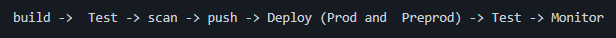
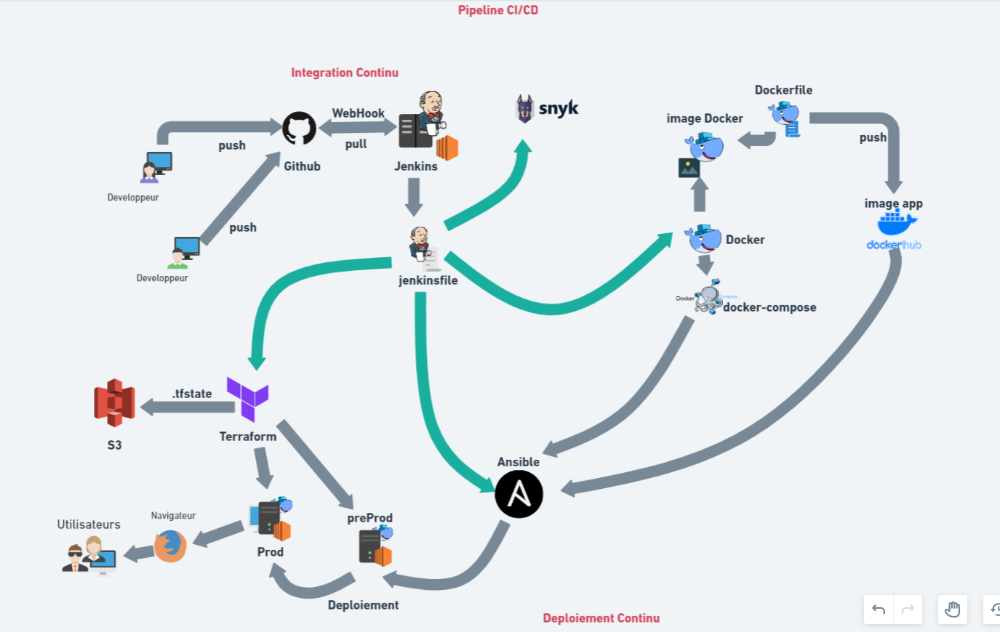
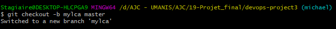
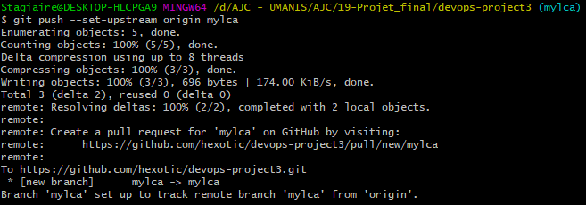
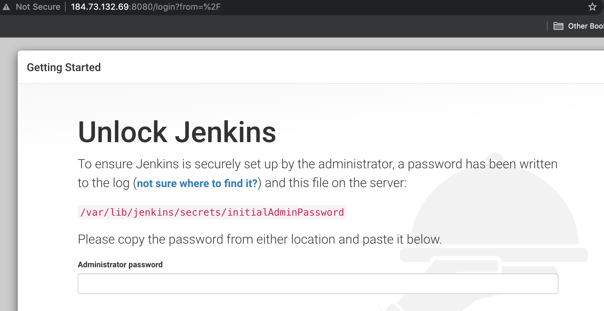
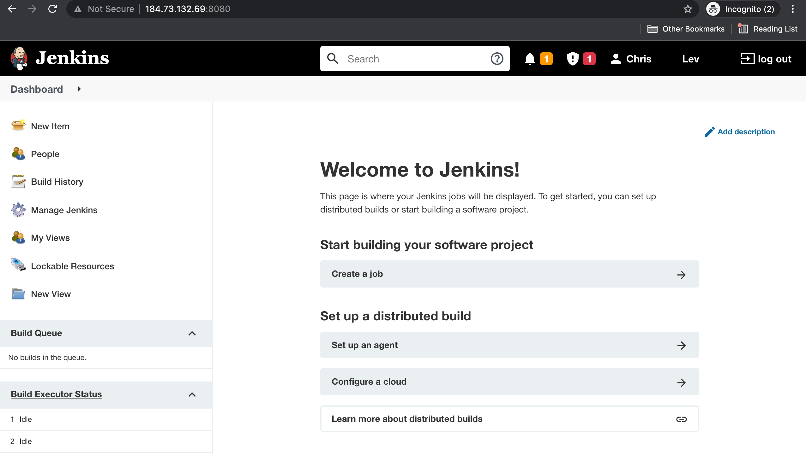

<div style="text-align: justify">

# Travaux réalisés

L'objectif de ce projet est de réalisé un pipeline CI/CD automatisé d'une application web Django conteneurisée. Dans ce but, l'utilisation des outils suivants est imposée :

* Jenkins
* Docker-compose
* Snyk
* Ansible
* Terraform
* Ssh

De plus, le pipeline CI/CD proposé doit permettre d'implémenter toutes les étapes recommandées qui seront détaillées ci-dessous.
<div style="text-align: center">
<br>Pipeline CI/CD imposé</div>

## Organisation

Afin de pouvoir communiquer et de travailler de manière collaborative, nous avons mis en place un Discord avec une salle textuelle et deux salles de réunions (vocales). Ainsi, dès le début du projet, chaque membre de l'équipe a étudié l'énonce du projet pour pouvoir échanger à propos de notre compréhension des différentes étapes à suivre pour mener à bien ce projet. En journée, nous avons travaillé à la fois en binôme (matinée) mais aussi tous ensemble afin de pouvoir bénéficier de l'expertise de chacun et de mettre en relation le travail fourni par chaque équipe. Le fait de travailler en binôme a permis de compléter les compétences de chacun.

## Création d'une machine virtuelle (EC2) AWS

Pour commencer le projet, nous avons créé une instance EC2 sur AWS dont les caracteristiques sont les suivantes :
t2.large avec 20Gb de stockage, un groupe de sécurité avec les ports 8080, 22 et 80 ouverts. Ainsi, il a fallu réaliser les étapes illustrées ci-dessous :

<div style="text-align: center">


</div><br>

Cette machine étant destinée à créer l'image de l'application et à servir de serveur Jenkins, le script suivant a été lancé à l'initialisation de l'instance (userdata) pour installer Docker et Jenkins :

```shell
#!/bin/bash
sudo apt update
sudo apt install default-jre -y
sudo apt install default-jdk -y
sudo wget -q -O - https://pkg.jenkins.io/debian-stable/jenkins.io.key | sudo apt-key add -
sudo sh -c 'echo deb http://pkg.jenkins.io/debian-stable binary/ > /etc/apt/sources.list.d/jenkins.list'
sudo apt update -y
sudo apt install jenkins -y
sudo systemctl enable jenkins
sudo systemctl start jenkins
curl -fsSL https://get.docker.com -o get-docker.sh
sh get-docker.sh
usermod -aG docker ubuntu
sudo usermod -aG docker jenkins
sudo service jenkins restart
```

## Détails du pipeline

Comme illustré dans l'image ci-dessous, le pipeline CI/CD réalisé permet d'utiliser différents outils (pré-requis) en implémentant toutes les phases du pipeline recommandé. Brièvement, le code envoyé sur GitHub par les développeurs var être détecté lors de son intégration sur la branche principale par l'orchestrateur Jenkins qui va déclecher la suites des étapes :

* Création d'une image de l'application avec Docker (via un Dockerfile)
* Scan de sécurité avec Snyk
* Lancement de l'application conteneurisée avec Docker-Compose
* Test de l'affichage de l'application sur un navigateur
* Stockage de l'image sur un dépot distant (DockerHub)
* Création d'une machine virtuelle et du groupe de sécurité sur AWS avec Terraform (environnements preprod)
* "Provisionning" de ce serveur par l'installation de docker et docker-compose avec Ansible
* Déploiement de l'application avec Ansible
* Test de l'affichage de l'application (en preprod) sur un navigateur
* Création d'une machine virtuelle et du groupe de sécurité sur AWS avec Terraform (environnements prod)
* "Provisionning" de ce serveur par l'installation de docker et docker-compose avec Ansible
* Déploiement de l'application avec Ansible
* Confirmation du status du pipeline par envoi d'une notification sur slack et affichage sur le README.md du dépôt distant (webhook)

<div style="text-align: center">
<br>Pipeline CI/CD proposé et outils utilisés</div>

### Intégration continue (CI)

#### GitHub

L'intégration continue permet d'ajouter continuellement du code dans l'application afin de corriger des bugs et de l'améliorer. Pour cela, le code de l'application est envoyé ("push") par les développeur sur Github, service web d'hébergement et de "versionning" décentralisé du code (reposant sur la technologie git).
Ainsi, un fork du dépôt du projet a été effectué pour créer un nouveau dépôt d'un membre de l'équipe. Ensuite, tous les autres membres de l'équipe ont été invité à collaborer sur ce dépôt (avec le rôle de Développeur pour obtenir les droit de modification du dépôt). Afin qu'ils puissent réaliser leurs propres tests sans créer de conflit avec le code des autres collaborateurs, chaque membre de l'équipe a créé une branche et s'est positionné sur sa propre branche avec la commande :

```shell
git checkout -b <nom> master
```
<div style="text-align: center">

</div><br>

Ensuite, pour pouvoir envoyer du code en local vers une branche du dépôt, la branche est configurée avec la commande :

```shell
git push --set-upstream origin <nom>
```

<div style="text-align: center">

</div><br>

Les branches utilisées pour ce projet sont illustrées ci-dessous.

<div style="text-align: center">

</div><br>

Afin de retrouver toutes les modifications apportées sur la branche master, nous utilisons la commande :

```shell
git pull origin master
```

<div style="text-align: center">

</div><br>

Enfin, si un code est fonctionnel, un "merge" de cette branche est effectué sur la branche principale ("master"). Il est donc nécessaire de se déplacer sur la branche receptrice afin de récuperer tout le contenu de la branche "expéditeur".

```shell
git checkout <nom_recepteur>
git merge origin <nom_expediteur>
```

<div style="text-align: center">

</div><br>

De plus, nous avons utilisé d'autres commandes git afin de versionner les modifications des différents fichiers :

```shell
git fetch origin master # récupération du contenu de la branche master sans valider les différentes modifications
git diff # comparaison des fichiers de deux branches
```

#### Conteneurisation

Comme décrit précédemement, la conteneurisation consiste à rassembler le code du logiciel et de tous ses composants de manière à les isoler dans leur propre conteneur (environnement virtuel). Ainsi, nous avons commencé par la création de l'image de l'application afin de pouvoir l'utiliser dans un conteneur Docker. Une image Docker est un modèle en lecture seule, utilisé pour créer des conteneurs Docker. Elle est une représentation statique composée de plusieurs couches empaquetant toutes les éléments nécessaires pour un environnement de conteneur opérationnel.
De ce fait, il a été nécessaire de créer un Dockerfile adapté au projet, fichier décrivant les éléments de l'image.

```dockerfile
# From https://docs.docker.com/samples/django/
FROM python:3
WORKDIR /code
COPY requirements.txt /code/
RUN pip install -r requirements.txt
COPY . /code/
EXPOSE 8000
RUN chmod +x entry_point.sh
CMD [ "./entry_point.sh" ]
```

Dans ce fichier, nous pouvons voir les commandes ci-dessous :

* `FROM` : utilisation d'une image python (v3)
* `WORKDIR` : création du répertoire projet `/code/` (si inexistant) et déplacement
* `COPY` : copie du fichier `requirements.txt` dans le répertoire projet
* `RUN` : installation des modules décrits dans le fichier `requirements.txt`
* `COPY` : copie des modules intallés vers le repertoire projet
* `EXPOSE` : port à utiliser par le conteneur de cette image 
* `RUN` : attribution des droits d'exécution au script `entry_point.sh`
* `CMD` : lancement de l'exécution du script

Les fichiers `requirements.txt` et `entry_point.sh` ont été fourni avec le projet à déployer et contiennent, respectivement, les modules à installer et le **script pour démarrer l'application**.

Pour utiliser ce Dockerfile, il est nécessaire d'utiliser la commande suivante afin de générer l'image de l'application :

```shell
docker build -t <tag> .
```

L'application nécessitant la présence de deux  containers (apllication web et base de données), nous avons du utiliser un docker-compose qui permet de lancer les deux contenaires : Web (Django) et sa base de données (Postgres).
Le fichier docker-compose contient le "build" de l'image ainsi que la création des deux contenaires.

```yaml
version: '3.3'

services:
  app:
    container_name: web
    image: "${USERNAME}/${IMAGE_NAME}:${IMAGE_TAG}"
    ports:
      - "8000:8000"
    links:
      - postgres
    environment:
      - POSTGRES_NAME=postgres
      - POSTGRES_USER=postgres
      - POSTGRES_PASSWORD=postgres
    depends_on:
      - postgres
    volumes:
      - /app:/app

  postgres:
    container_name: postgres
    image: postgres:14
    ports:
      - "5432:5432"
    environment:
      - POSTGRES_USER=postgres
      - POSTGRES_PASSWORD=postgres
    volumes:
      - /db:/var/lib/postgresql/data

volumes:
  db:
  app:
```

Dans ce fichier docker-compose, il est possible de retrouver, entre autres :

* Deux services `app` et `postgres`
* Un premier container, nommé `web` contenant les informations suivantes :
  * `image` : "build" de l'image via le Dockerfile
  * `ports` : port exposé entre le master et le contenaire
  * `links` : connection des variables d'environnement de `postgres`
  * `environment` : variables d'environnement
  * `depends_on` : demande explicitement la création du container `postgres`
  * `volumes` : repertoire partagé entre la machine master et le contenaire
* Un deuxième container, nommé `postgres` contenant les informations suivantes :
  * `image` : utilisation de l'image `postgres` (v14) officielle du Docker Hub
  * `ports` : port exposé entre le master et le contenaire
  * `environment` : variables d'environnement
  * `volumes` : repertoire partagé entre la machine master et le contenaire

Le Docker Hub est un service de registre de référentiel fourni par Docker Inc. Il nous permet d'extraire et de pousser des images Docker vers et depuis Docker Hub.

Pour installer docker-compose, il est nécessaire d'utiliser les commandes suivantes :

```shell
sudo curl -L "https://github.com/docker/compose/releases/download/1.29.2/docker-compose-$(uname -s)-$(uname -m)" -o /usr/local/bin/docker-compose
sudo chmod +x /usr/local/bin/docker-compose
sudo ln -s /usr/local/bin/docker-compose /usr/bin/docker-compose 
```

L'utilisation de docker-compose se fait via la commande suivante :

```shell
docker-compose up -d
```

Il est ensuite possible de visualiser que les 2 contenaires `web` et `postgres` ont bien été créés via la commande :

```shell
docker ps -a
```

<div style="text-align: center">

</div><br>

Il est donc possible, via un navigateur, de vérifier que l'application Django s'affiche correctement en allant sur l'url http://<IP publique>:8000.

<div style="text-align: center">

</div><br>

Ces différentes étapes nous permettent donc de valider la conteneurisation de l'application fournie et de passer à l'écriture du pipeline automatisé.

#### Jenkins

Jenkins est l'orchestrateur de notre pipeline car il permet le lancement des différentes tâches du pipeline, de la conteneurisation de l'application à son déploiement sur l'environnement de production. Pour cela, il est nécessaire de finaliser l'installation du serveur Jenkins sur la machine virtuelle décrite lors de la conteneurisation.
Par défaut, Jenkins est disponible via l'url http://<IP publique>:8080.

<div style="text-align: center">

</div><br>

Comme indiqué, il est nécessaire de récupérer le mot de passe par défaut via la commande :

```shell
sudo cat /var/lib/jenkins/secrets/initialAdminPassword
```

L'installation se finalise par l'installation des plugins suggérés et la création du compte administrateur.

<div style="text-align: center">

</div><br>

L'objectif de cette partie est de permettre à l'orchestrateur Jenkins de piloter et d'automatiser tout le pipeline lors de la validation du code de l'application par l'intégration de ce code sur la branche "master". 

Pour cela, il est nécessaire d'installer les plugins qui seront nécessaires au pipeline pour :

* La conteneurisation avec Docker et Docker-compose

<div style="text-align: center">

</div><br>

* Le scan de sécurité avec Snyk

<div style="text-align: center">

</div><br>

* L'affichage du status du pipeline dans le fichier README.md du Github

<div style="text-align: center">

</div><br>

* L'envoi d'une notification du status du pipeline dans Slack (outil de communication collaborative)

<div style="text-align: center">

</div><br>

Avant de commencer la création du pipeline, il faut donner à Jenkins les accès ("credentials") aux différentes plate-formes qui communiqueront avec le pipeline :

* DockerHub pour la sauvegarde et l'utilisation d'image
* AWS pour la création des machines virtuelles (environnements preprod prod)
* Snyk pour le scan de sécurité
* Slack pour l'envoi de la notification

<div style="text-align: center">

</div><br>

Ensuite, il est nécessaire de relier Jenkins au dépôt distant Github en indiquant le type de dépot, l'URL du dépôt, la branche à surveiller et le nom du fichier (Jenkinsfile) décrivant le pipeline.

<div style="text-align: center">


</div><br>

Pour finir la configuration de Jenkins, les plugins pour Slack et Snyk sont définis comme suit.
<div style="text-align: center">


</div><br>

Le fichier Jenkinsfile, présent sur le dépôt GitHub, qui permet de décrire et d'automatiser le pipeline est :

```yaml
pipeline {
    environment {
        USERNAME = 'projet03ajc'
        IMAGE_NAME = 'projet_django'
        VERSION = 'v1.0.0'
        IMAGE_TAG = "${VERSION}-${env.BUILD_NUMBER}"
    }

    agent none

    stages {

        stage ('Build Application') {
            agent any
            steps {
                script {
                    sh '''
                        docker rm -f $(docker ps -aq) && docker rmi -f $(docker images -aq) || true
                        docker build -t $USERNAME/$IMAGE_NAME:$IMAGE_TAG .
                    '''
                }
            }
        }

        stage('Security scan') {
            agent any
            environment {
                SNYK_TOKEN = credentials('SNYK_SECRET')
            }
            steps {
                sh """
                    snyk auth ${SNYK_TOKEN}
                    snyk container test --file=$WORKSPACE/Dockerfile $USERNAME/$IMAGE_NAME:$IMAGE_TAG || true
                """
            }
        }

        stage ('Run test containers') {
            agent any
            steps {
                script {
                    sh '''
                       docker-compose up -d
                       sleep 5
                   '''
                }
            }
        }


        stage ('Test application') {
            agent any
            steps {
                script {
                    sh '''
                       curl http://localhost:80 | head -n 100 | grep -iq "django"
                   '''
                }
            }
        }

        stage ('Save artifact') {
            agent any
            environment {
                PASSWORD = credentials('dockerhub_password')
            }
            steps {
                script {
                    sh '''
                       docker login -u $USERNAME -p $PASSWORD
                       docker push $USERNAME/$IMAGE_NAME:$IMAGE_TAG
                       docker-compose down -v --rmi all || true
                   '''
                }
            }
        }

        stage ('Deploy pre prod infra') {
            agent any
            environment {
                AWS_ACCESS_KEY_ID     = credentials('AWS_ACCESS_KEY_ID')
                AWS_SECRET_ACCESS_KEY = credentials('AWS_SECRET_ACCESS_KEY')
            }

            steps {
                withCredentials([sshUserPrivateKey(credentialsId: 'ec2_prod_private_key', keyFileVariable: 'keyfile', usernameVariable: 'NUSER')]) {
                    catchError(buildResult: 'SUCCESS', stageResult: 'FAILURE') {
                        script {
                            sh '''
                            pwd
                            echo $WORKSPACE
                            echo $JENKINS_HOME
                            cd terraform/preprod
                            terraform init -no-color
                            terraform destroy -auto-approve -no-color
                            terraform plan -no-color
                            terraform apply -auto-approve -no-color
                            sleep 10
                            cat ec2-info.txt
                            read EC2_IP IP_PRIV < ec2-info.txt || true
                            cd ../../
                            echo "USERNAME=${USERNAME}" > env_file
                            echo "IMAGE_NAME=${IMAGE_NAME}" >> env_file
                            echo "IMAGE_TAG=${IMAGE_TAG}" >> env_file
                            SSH_OPT="-o StrictHostKeyChecking=no -o ConnectTimeout=30 -o ConnectionAttempts=10"
                            until scp -i ${keyfile} ${SSH_OPT} docker-compose.yml env_file ${NUSER}@${EC2_IP}:. ; do sleep 1 ; done
                            sleep 10
                        '''
                        }
                    }
                }
            }
        }

        stage ('Deploy pre prod app') {
            agent any

            steps {
                script {
                    sh '''
                        cd $WORKSPACE/terraform/preprod
                        cat ec2-info.txt
                        read EC2_IP IP_PRIV < ec2-info.txt || true
                        # Provisioning with Ansible
                        cd $WORKSPACE/ansible
                        rm -fr roles || true
                        mkdir roles && cd roles
                        git clone https://github.com/hexotic/dockercompose_role.git
                        git clone https://github.com/hexotic/docker_role.git
                        cd ..
                        ansible -i hosts.yml preprod -m ping -e preprod_ip=${IP_PRIV}
                        ansible-playbook -i hosts.yml preprod.yml -e preprod_ip=${IP_PRIV}
                    '''
                }
            }
        }

        stage ('Test pre prod deployment') {
            agent any
            environment {
                AWS_ACCESS_KEY_ID     = credentials('AWS_ACCESS_KEY_ID')
                AWS_SECRET_ACCESS_KEY = credentials('AWS_SECRET_ACCESS_KEY')
            }

            steps {
                script {
                    sh '''
                       cd $WORKSPACE/terraform/preprod
                       read EC2_IP IP_PRIV < ec2-info.txt || true
                       CURL_OPTS="-v -4 --connect-timeout 10 --retry 10 --retry-connrefused --retry-max-time 40 --retry-delay 10"
                       curl ${CURL_OPTS} -o index.html http://${EC2_IP}:80
                       cat index.html | grep -iq "django"
                       # Attempt to destroy infrastructure but don't fail if a problem occurs.
                       terraform destroy -auto-approve -no-color || true
                   '''
                }
            }
        }

        stage ('Deploy prod infra') {
            agent any
            environment {
                AWS_ACCESS_KEY_ID     = credentials('AWS_ACCESS_KEY_ID')
                AWS_SECRET_ACCESS_KEY = credentials('AWS_SECRET_ACCESS_KEY')
            }

            steps {
                withCredentials([sshUserPrivateKey(credentialsId: 'ec2_prod_private_key', keyFileVariable: 'keyfile', usernameVariable: 'NUSER')]) {
                    catchError(buildResult: 'SUCCESS', stageResult: 'FAILURE') {
                        script {
                            sh '''
                            pwd
                            echo $WORKSPACE
                            echo $JENKINS_HOME
                            cd terraform/prod
                            terraform init -no-color
                            terraform destroy -auto-approve -no-color
                            terraform plan -no-color
                            terraform apply -auto-approve -no-color
                            sleep 10
                            cat ec2-info.txt
                            read EC2_IP IP_PRIV < ec2-info.txt || true
                            cd ../../
                            echo "USERNAME=${USERNAME}" > env_file
                            echo "IMAGE_NAME=${IMAGE_NAME}" >> env_file
                            echo "IMAGE_TAG=${IMAGE_TAG}" >> env_file
                            SSH_OPT="-o StrictHostKeyChecking=no -o ConnectTimeout=30 -o ConnectionAttempts=10"
                            until scp -i ${keyfile} ${SSH_OPT} docker-compose.yml env_file ${NUSER}@${EC2_IP}:. ; do sleep 1 ; done
                            sleep 10
                        '''
                        }
                    }
                }
            }
        }

        stage('Deploy prod app') {
            agent any
            steps {
                script {
                    timeout(time: 15, unit: 'MINUTES') {
                    input message: 'Do you want to approve deployment in production?', ok: 'Yes'
                    }

                    sh '''
                        cd $WORKSPACE/terraform/prod
                        cat ec2-info.txt
                        read EC2_IP IP_PRIV < ec2-info.txt || true
                        cd ../../
                        # Provisioning with Ansible
                        cd $WORKSPACE/ansible
                        rm -fr roles || true
                        mkdir roles && cd roles
                        git clone https://github.com/hexotic/dockercompose_role.git
                        git clone https://github.com/hexotic/docker_role.git
                        cd ..
                        ansible -i hosts.yml prod -m ping -e prod_ip=${IP_PRIV}
                        ansible-playbook -i hosts.yml prod.yml -e prod_ip=${IP_PRIV}
                    '''
                }
            }
        }

        stage ('Test prod deployment') {
            agent any

            steps {
                script {
                    sh '''
                       cd $WORKSPACE/terraform/prod
                       read EC2_IP IP_PRIV < ec2-info.txt || true
                       CURL_OPTS="-v -4 --connect-timeout 10 --retry 10 --retry-connrefused --retry-max-time 40 --retry-delay 10"
                       curl ${CURL_OPTS} -o index.html http://${EC2_IP}:80
                       cat index.html | grep -iq "django"
                   '''
                }
            }
        }

    }

    post {
        success{
            slackSend (color: '#00FF00', message: "SUCCESSFUL: Job '${env.JOB_NAME} [${env.BUILD_NUMBER}]' (${env.BUILD_URL})")
        }
        failure {
            slackSend (color: '#FF0000', message: "FAILED: Job '${env.JOB_NAME} [${env.BUILD_NUMBER}]' (${env.BUILD_URL})")
        }
    }
}
```

Pour expliciter ce fichier, les différentes étapes sont :

* "Build Application" : commandes pour le nettoyage de l'environnement et la construction de l'image (voir chapitre précédent "conteneurisation")
* "Security scan" : commandes pour réaliser le scan de sécurité via le plugin Snyk
* "Run test containers" : commandes pour lancer les conteneurs avec docker-compose (voir chapitre précédent "conteneurisation")
* "Test application" : commande pour tester l'affichage de l'application en local via une commande `curl` pour obtenir le contenu de la page et la recherche du mot "django" via `grep` (avec l'option `-i`pour ne pas tenir compte de la casse)
* "Save artifact" : commandes pour envoyer l'image générée et validée de l'application sur DockerHub (tagguée avec le numéro du "build" du pipeline)
* "Deploy pre prod infra" : commandes Terraform pour créer la machine virtuelle (EC2) de l'environnement preprod sur AWS (voir ci-dessous)
* "Deploy pre prod app" : commandes pour le déploiement de l'application sur la preprod via Ansible (voir ci-dessous)
* "Test pre prod deployment" : commandes
* "Deploy prod infra"
* "Deploy prod app"
* "Test prod deployment"
* "Post"


### Déploiement continu (CD)

### Résultats obtenus

</div>